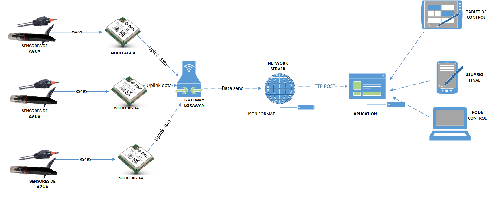

# Ejercicio CiberKillChain - Ataque

Hacer una copia de este documento para utilizar com plantilla para el ejercicio quitando las instrucciones y el ejemplo.

## Alumno

Jhonatan Alexander Juño Garcia  (i0611)

## Enunciado

Armar una cyberkillchain usando técnicas de la matriz de Att&ck para un escenario relacionado al trabajo práctico de la carrera.

## Datos del Trabajo Práctico de Final de Carrera
Todavia no tengo definido el Trabajo Practico de Final de Carrera, por lo que presentare un escenario de la empresa en la que trabajo.

### Sistema de Monitoreo de Calidad de Agua en Reservorios Agricolas para Empresa AgroExportadora
Se implementa unos Nodos Controladores LoRaWAN  basado en el Modulo RAK3172 de la Compañia RAKWireles, que lleva Microcontrolador + Modulo de Radio LoRA, un modulo de gestion de carga de baterias y un modulo de comunicacion RS485 RTU para sensores : PH y Conductividad Electrica. Ese nodo va conectado a un Gateway Comercial y este a su vez a un Network Server. Finalmente para el despliegue de la Aplicacion se contrato un Servicio de Aplication Server de Tercero [TagoIO](https://tago.io/), que ya Provee Plantillas para gestion de conecciones, almacenamiento de Datos, gestion de ususarios, reglas alarmas, etc. En el siguiente Diagrama se muestra el Sistema:

## Resolución

### Reconnaissance

* Nodo RAK3172 
  - La ubicacion de los Nodos y Sensor es a la orilla del Resevorio. El acceso al equipo es rapido para que el personal pueda hacer las calibraciones de los sensores. El area se encuentra cercado pero no tiene Vigilancia Permanente. Hay caminos que llevan a cada reservorio pero no se encuentran vigilados, la presencia de personas a partir de las 4pm es nula ( Ultimo turno de guardia del Lugar). Hay posibilidad de que alguien no autorizado pueda acceder al nodo en horas de la noche. Usualemte estos mopdulos de comunicacion ofrecen la opcion de debugear por RS232 con comandos AT. Se podria intertar acceder al alguna interfaz de cominicacion en caso no este protegido, asimismo verificar marca, modelo del harware utilizado. [T1592-001](https://attack-mitre-org.translate.goog/techniques/T1592/001/)

  
* Network Server y Aplicativo:
  - La empresa que tiene la solucion,postea regularmente en redes sociales imagenes sobre sus procesos de siembra y cosecha. En ocaciones publican imagens sobre los graficos y tablas de su plataforma. Se verifico en videos de publicidad que tienen acceso tanto por Aplicativo Web, y Aplicativo Movil.[T1591](https://attack-mitre-org.translate.goog/techniques/T1591/)
  - Se encontro informacion por trabajores de la empresa publicando en redes como Linkedin [T1589-003](https://attack-mitre-org.translate.goog/techniques/T1589/003/)que el Sistema que tienen envia alertas por SMS y Correo electronico. De esta forma, analizando las imagenes y un poco de investigacion se concluye que utilizan el servio de TagoIO y muy posiblemente un Network Server Libre como TTN o Loriot.
  

### Weaponization
* Nodo RAK3172 
  - Podemos notar que el equipo tienen una interfaz de comunicacion RS232 que podria ser vulnerado. Revisamos la documentacion del fabricante del [Modulo](https://docs.rakwireless.com/Product-Categories/WisDuo/RAK3172-Module/AT-Command-Manual/) Se indica que es posible acceder a las llaves de Autenticacion LoraWan via comando AT ( DEV EUI, APP EUI, APPKEY).

* Network Server y Aplicativo:
 - Revisamos documentacion de Loriot y TagoIO y notamos que la Autenticacion en 2 pasos no viene activado por defecto. Hay posibilidad de conseguir el acceso del correo y contraseña de alguno de los trabajadores que tienen mas actividad en redes sociales.
 - Con Acceso de Loriot y Tago puedo autenticar un nuevo dispositivo malicioso para que envie datos erroneos o intercertar la integracion de Tago para modificar valores de control.
  
  
### Delivery
  - Visita para verificacion del equipo. Validamos que el modulo es un RAK3172 y buscamos el acceso RS232 para ver si no esta bloqueado el acceso a comandos AT.
  - En el firmware por defecto no viene bloqueado el puerto RS232, por lo que es posible obtener las llaves de Autenticacion.
  - POr redes sociales obtenemos la lista de correos y/o Telefonoa de posibles Usuarios administrador del sistema.
  -  Creación de un perfil falso en LinkedIn con intereses afines a los que publica la empresa, Intentamos hacer contacto con algun trabajador. Intentamos un ataque via Pishing 
  - Intentamos el envio de un correo/SMS con un mensaje de Alerta de Valores, con un enlace malicioso en un login falso para obtener contraseña. ( Replicamos Login de Lorior y TagoIO)

### Exploit
  - Obteneiendo las Claves de Autenticacion de un nodo Podemos generar un nodo Falso para conectar a la Red.
  - Con la contraseña Podemos ingresar al aplicativo revisar cantidad de nodos, valores de alarmas generadas, ubicaciones y revisar las variables de control, etc.
  
### Installation  
  - Generamos un nodo falso en Loriot para reemplazar un nodo instalado. Este nodo enviando valores fuera de rango para generar una falla en los actuadores.
  - Generamo un nuevo analsis de datos en TagoIO, para anular el envio de Correos y SMS de Alarmas

### Command & Control
  - Instalamos el nuevo nodo falso y cargamos un scrip malisioso para envio erroneo de notificaciones, que haga creer el la compañia que el sistema esta trabajando correctamente.
  
### Actions on Objectives
  - Estraer informacion de mediciones de calidad de agua, posibilidad de secuetro de la base de datos historica.
  - Eliminacion de la data del usuario, con consecuencia perjudicar la opracion.
  - Perjidicar la producccion de la empresa, al haber alterado los parametros de calidad de agua en el riego. 
  